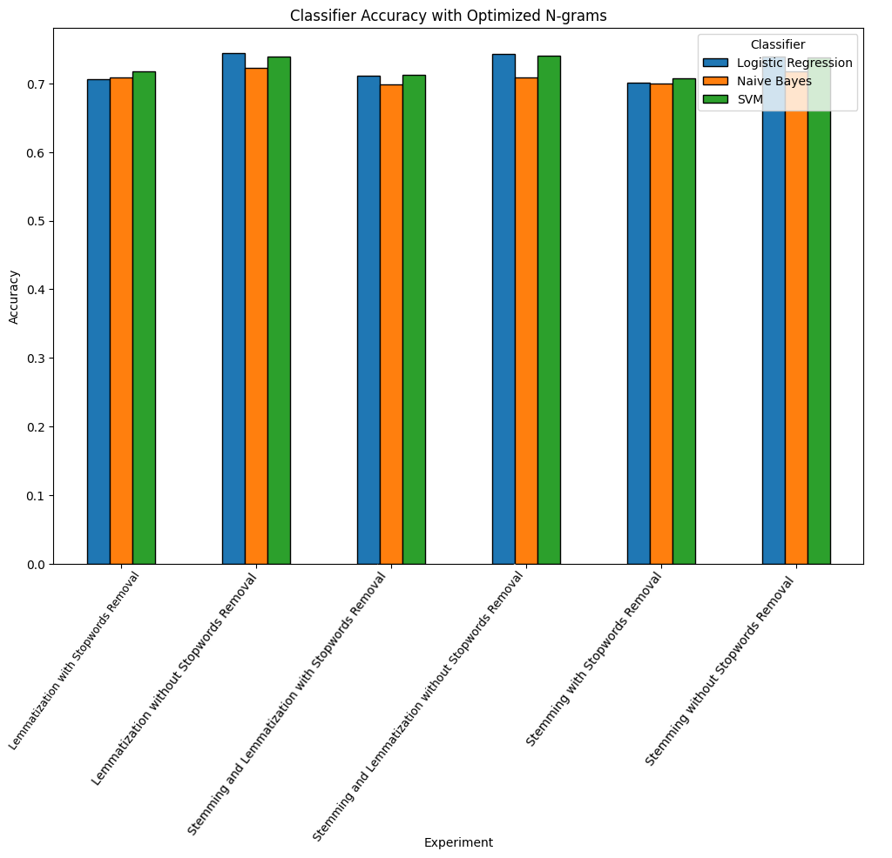

# fds-final-project
This project is part of Foundation of Data Science Course in Sapienza University 2024. It focuses on sentiment analysis of Libyan dialect poems using machine learning (ML) techniques. The dataset includes annotated Libyan poems labeled as positive or negative, and three classifiers—Support Vector Machine (SVM), Naïve Bayes (NB), and Logistic Regression (LR)—were used for the analysis. Preprocessing steps include cleaning, tokenization, normalization, stopword removal, stemming, and lemmatization, with feature extraction techniques such as TF-IDF and N-grams (Unigrams, Bigrams, and Trigrams). Six experiments were conducted to evaluate the impact of various preprocessing and feature extraction methods on classifier performance. The results showed that SVM performed the best, achieving an accuracy of 74.63% when Unigrams and Trigrams were used. The project files include the dataset, preprocessing scripts, model training and evaluation scripts, and the final report, which documents the methodology, results, and comparisons with previous studies.

# Note
The dataset we used for this project is a private dataset. We can't upload it in a public repo without the author's authorization.  
## Paper link: https://arxiv.org/abs/2109.07203

### Some Results
The results highlight the impact of various preprocessing strategies on sentiment classification accuracy. The table below summarizes the accuracy for different experiments:

| Experiment                                | Logistic Regression | Naive Bayes | SVM   |
|-------------------------------------------|----------------------|-------------|-------|
| Lemmatization with Stopword Removal       | 0.72                | 0.68        | 0.74  |
| Lemmatization without Stopword Removal    | 0.70                | 0.65        | 0.71  |
| Stemming with Stopword Removal            | 0.73                | 0.69        | 0.75  |
| Stemming without Stopword Removal         | 0.71                | 0.67        | 0.72  |
| Stemming and Lemmatization with Stopwords | 0.74                | 0.70        | 0.76  |
| Stemming and Lemmatization without Stopwords | 0.72             | 0.66        | 0.73  |

